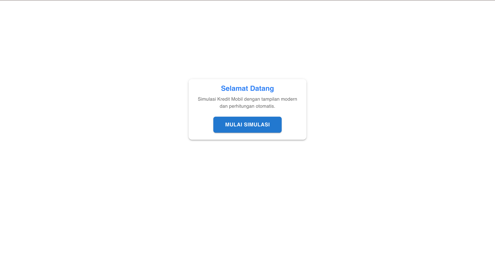
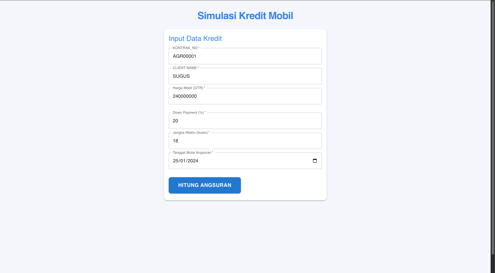
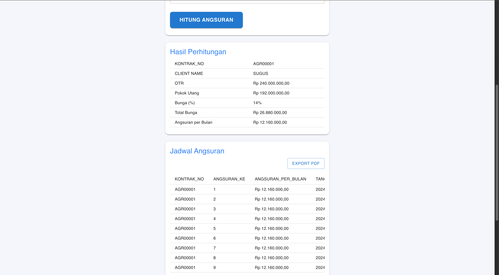
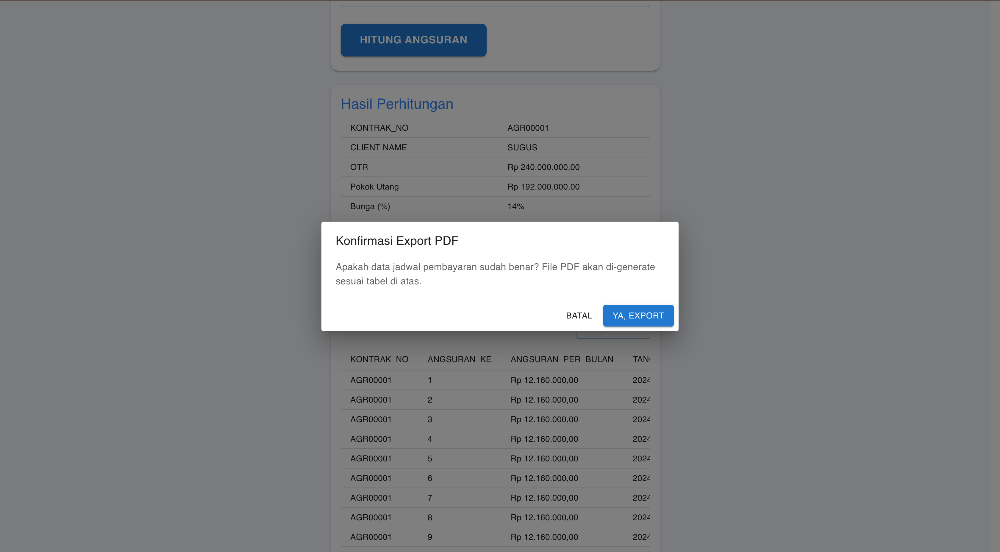

# Simulasi Kredit Mobil

Aplikasi simulasi kredit mobil berbasis React + Material UI.

## Cara Menjalankan

1. Install dependencies:
   ```sh
   npm install
   ```
2. Jalankan aplikasi:
   ```sh
   npm start
   ```

Aplikasi akan berjalan di `http://localhost:3000`.




